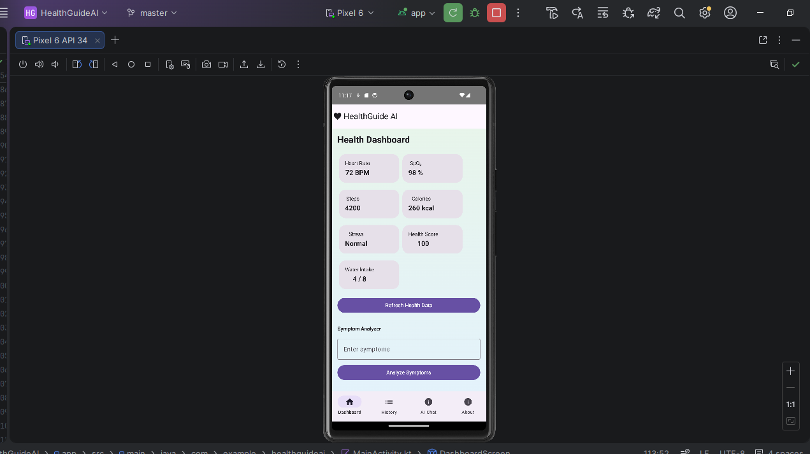
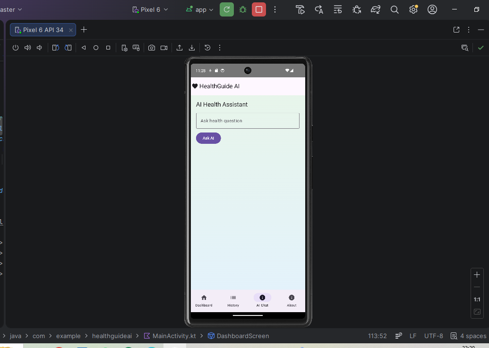
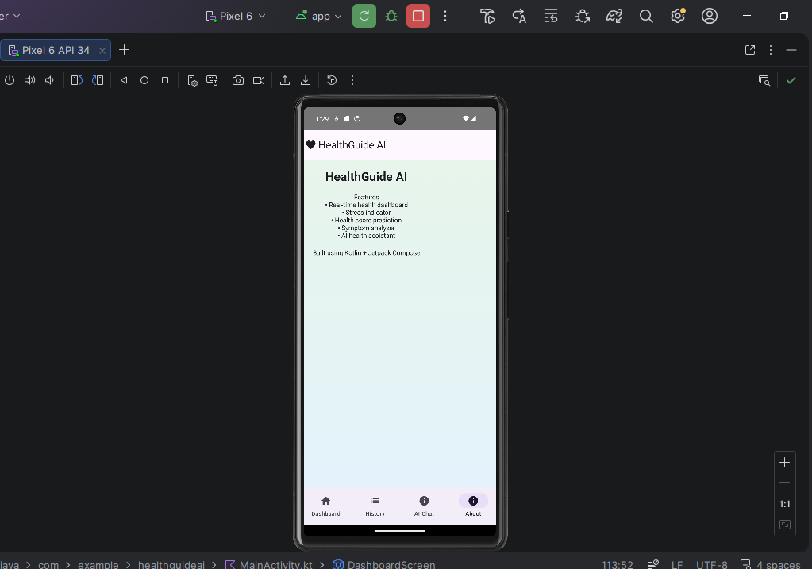

# HealthGuide AI

HealthGuide AI is an Android health monitoring application built using Kotlin and Jetpack Compose.

Features:
- Health dashboard
- Symptom analyzer
- AI health assistant
- Health history tracking

Developer:
Keerthana H L
USN: 1JS22CI028

## Screenshots

### Dashboard

### AI Chat

### About Screen

